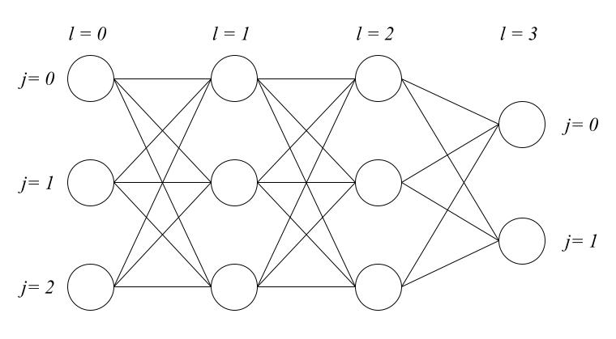
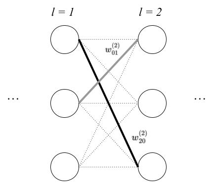
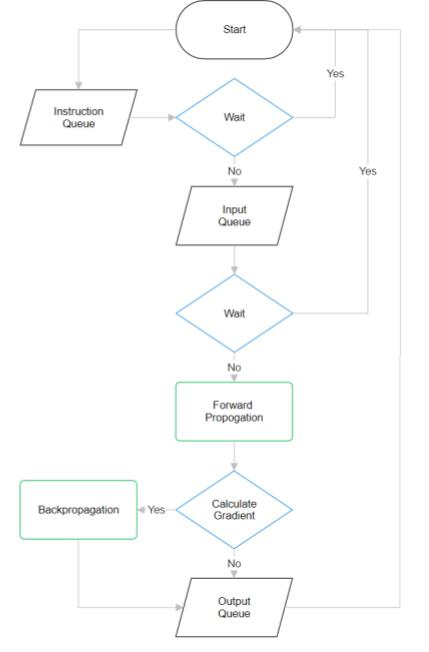
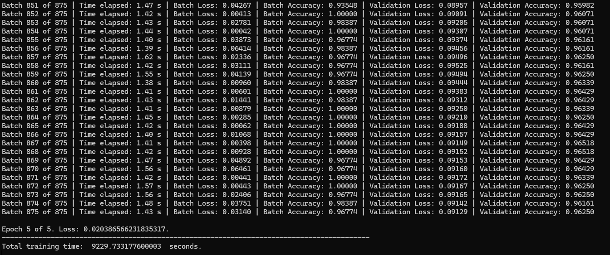
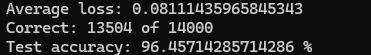
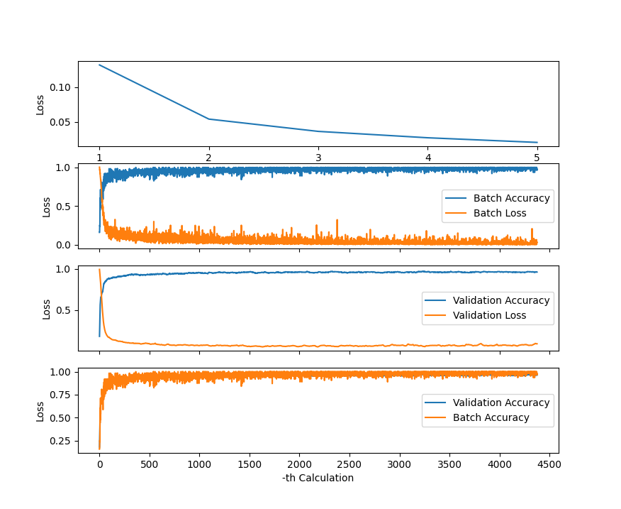

# Using Python to Create a Deep Neural Network from Scratch

## Introduction

This personal project aims to build a deep neural network from scratch using only python and numpy libraries. The goal of this project is to serve as a self-exercise into the field of machine learning to help myself understand the workings of a multi-layer perceptron better, and so the project begins with the mathematical side of DNN, such as forward and backpropogation. Further on in the project, multiprocessing is also employed to optimise runtimes, allowing the computer to calculate gradients for different instances at the same time. 

## Mathematics of DNN

### Structure of a DNN

The structure of a deep neural network consists of one input layer, a series of hidden layers, and one output layer. Each layer consists of numerous nodes, each node connecting to every other node in the previous and next layer. This allows for the formation of complex relationships between each node and thus extending to the entire network, allowing for it to "learn" patterns in data. 

<center></center>

In the above figure, we have a DNN with an architecture of 3-3-3-2:  3 input nodes, 2 hidden layers with 3 nodes each, and 2 output nodes. Each node has a corresponding layer number, $l$, and its position within the layer $j$, both of which follows zero-based indexing. With this, we can denote a node using $\nu^{(l)}_j$. 

### Weights and Biases

The intricate relationships that form between each node and layer and subsequently the entire network is based on the fact that each node's value is a linear combination of the values of every node of the previous layer. The coefficients of the values of the nodes of the previous layer are known as weights, and can be represented by the lines connecting the nodes in the above figure. For some node $\nu^{(l)}_j$, and a node in the previous layer $\nu^{(l-1)}_k$, we denote the weight connecting these two nodes to be $w^{(l)}_{jk}$.

<center></center>

However, each node $\nu^{(l)}_j$ also has a "bias" term corresponding to it, denoted as $b^{(l)}_j$, and so the value associated with each node $a^{(l)}_j$ is given by the sum

$$
\begin{align}
a^{(l)}_j = \sigma \left(\sum_{k = 0}^{N(l-1)-1}w^{(l)}_{jk}\cdot a^{(l-1)}_k + b^{(l)}_j\right)
\end{align}
$$

where $N(l-1)$ is the number of nodes in the layer $l-1$. Note that in front, there appears a function $\sigma$ that wraps around the entire calculation. This is known as an activation function which processes the "pure" value of the node (the linear combination + bias) into an "activated" value. From now on, we denote the "pure" value of a node to be $z^{(l)}_j$ and its "activated" value to be $a^{(l)}_j$. Hence, we can see that the value of a node (both pure or activated) depends on the _activated_ values of the previous nodes. 

#### Activation Functions

If all node values were kept as its "pure" value $z^{(l)}_j$, we would only ever have linear relationships between each node, and that would cause the neural network to be mathematically equivalent to having no hidden layers at all, and the network would only ever be able to learn linear patterns. However, in real life, many patterns are more complex than linear relationships, and so by passing the "pure" value through a non-linear function, we can allow the DNN to learn non-linear patterns. There are many activation functions, each suited for a different purpose. Some activation functions depend only on the $z^{(l)}_j$ of the node in question, such as the Rectified Linear Unit (ReLU):

$$
\begin{align}
a^{(l)}_j = \sigma \left( z^{(l)}_j \right) = 
\begin{cases}
z^{(l)}_j, &z^{(l)}_j > 0 \\ 
0, &z^{(l)}_j \leq 0
\end{cases}
\end{align}
$$

whereas some other activation functions depend on the $z^{(l)}_k$ of all nodes in the layer, such as the Softmax activation function:

$$
\begin{align}
a^{(l)}_j = \sigma \left( z^{(l)}_j \right) =  \frac{\exp{z^{(l)}_j}}{\sum_{k = 0}^{N(l)-1}\exp{z^{(l)}_k}}
\end{align}
$$

### Forward Propagation and Loss

For a specific set of input values, we can use the above equation to calculate the values of every node in the next layer, and using those values, calculate the values of the next layer so on and so forth, until we _propagate_ and calculate the values of the output layer. This process is known as forward propagation. 

During the training process, multiple pairs of inputs and labels (correct "answers") are used. For each pair, we pass the inputs through the DNN, and using forward propagation, we return with some outputs (predicted "answers") $a^{(L_f)}_j$ ($L_f$ is the final/output layer). We then compare the correct values $y_j$ and predicted values $a^{(L_f)}_j$, and measure how far off we are, or how wrong we are. To mathematically encapsulate the idea of "wrongness", we use what we call a Loss function $L(y_j, a^{(L_f)}_j)$. Using this Loss function, it tells us how far off we are from the correct answer, and depending on it, we can adjust the values of the weights and biases and try a different pair again. By repeating this process, we essentially end up tuning our DNN to be able to recognise the patterns of the input and output pairs.

How the Loss function encapsulates "wrongness" depends on the type of Loss function itself. For example, in regression, squared loss is a common loss function, where we measure the total magnitude of the differences between the predicted and true values:

$$
\begin{align}
L = \sum_{j = 0}^{N(L_f)-1}\left(y_j - a^{(L_f)}_j\right)^2
\end{align}
$$

Another loss function is known as Categorical Cross-Entropy, and is commonly used in cases where the output is separated into discrete classes:

$$
\begin{align}
L = \sum_{j = 0}^{N(L_f)-1}\left(-y_j \cdot \log a^{(L_f)}_j\right)
\end{align}
$$

There are many different types of loss functions, each suited for a different class of problems. There is no one-size-fits-all type of loss function. 

### Backpropagation 

Backpropagation refers to the process where the loss function is used to tune the weights and biases of the model to improve it. If we can find how a change in the weights/biases affects the loss ("wrongness"), we can update the weights and biases according to that to decrease the loss. How a change in the weights/biases affects the loss is exactly the derivative (more accurately, the partial derivative) of loss w.r.t the weights and biases:

$$
\begin{align}
\frac{\partial L}{\partial w^{(l)}_{jk}} \qquad \frac{\partial L}{\partial b^{(l)}_j}
\end{align}
$$

From multivariable calculus, we can use these partial derivatives to form a gradient vector field $\nabla L$, which, for any input in the input space (in this case, a vector of all parameters $\textbf{p}$) returns a vector of steepest ascent up the loss function. Hence, to minimise the loss function, we must move in the opposite direction to said vector, namely $-\nabla L$ with some step-size $r$ known as the learning rate. So, we can form two equations that tell us how to update the $i$-th iteration weights and biases:

$$
\begin{align}
\textbf w_{i+1} &= \textbf w_i - r\nabla L_w \\ 
\textbf b_{i+1} &= \textbf b_i - r\nabla L_b \\ 
\end{align}
$$

where $\nabla L_w$ and $\nabla L_b$ are the gradients for updating the weights and biases respectively.

Let us look at how to calculate the partial derivatives of w.r.t. to each parameter now, taking $w^{(1)}_{00}$ as an example:

<center></center>

We begin by looking at the equation $\partial L/\partial w^{(1)}_{00}$. From the above figure, we can see that the only value which is dependent on $w^{(1)}_{00}$ is $a^{(1)}_{0}$, which in turn depends on $z^{(1)}_{0}$. Using the chain rule, we can rewrite it as follows:

$$
\begin{align}
\frac{\partial L}{\partial w^{(1)}_{00}} = \frac{\partial L}{\partial a^{(1)}_{0}}\frac{\partial a^{(1)}_{0}}{\partial w^{(1)}_{00}} = \frac{\partial L}{\partial a^{(1)}_{0}}\frac{\partial a^{(1)}_{0}}{\partial z^{(1)}_{0}} \frac{\partial z^{(1)}_{0}}{\partial w^{(1)}_{00}}
\end{align}
$$


Looking at the RHS, we begin with $\partial z^{(1)}_{0}/\partial w^{(1)}_{00}$, which is simply $a^{(0)}_0$, and $\partial a^{(1)}_{0}/\partial z^{(1)}_{0}$ depends on the activation function we use. However, $\partial L/\partial a^{(1)}_{0}$ is more complicated. 


We begin with the total derivative, $dL$. Note that $a^{(1)}_{0}$ is used in the calculation of all three nodes in $l = 2$, so we must take into account $a^{(2)}_{i} (i = 0, 1, 2)$

$$
\begin{align}
dL &= \frac{\partial L}{\partial a^{(2)}_{0}} da^{(2)}_{0} + \frac{\partial L}{\partial a^{(2)}_{1}} da^{(2)}_{1}+\frac{\partial L}{\partial a^{(2)}_{2}} da^{(2)}_{2}\\
\frac{\partial L}{\partial a^{(1)}_{0}} &= \frac{\partial L}{\partial a^{(2)}_{0}} \frac{\partial a^{(2)}_{0}}{\partial a^{(1)}_{0}} + \frac{\partial L}{\partial a^{(2)}_{1}} \frac{\partial a^{(2)}_{1}}{\partial a^{(1)}_{0}} + \frac{\partial L}{\partial a^{(2)}_{2}} \frac{\partial a^{(2)}_{2}}{\partial a^{(1)}_{0}} \\ 
&= \sum^2_{i = 0} \frac{\partial L}{\partial a^{(2)}_{i}} \frac{\partial a^{(2)}_{i}}{\partial a^{(1)}_{0}}
\end{align}
$$

We can see that this leads to another set of partial derivative $\partial a^{(2)}_i /\partial a^{(1)}_0$. We must be careful here, in that $a^{(2)}_i$, depending on what activation function we use, can depend on multiple $z^{(2)}$, such as in the case of Softmax, and so similar to how we calculated $dL$, we first find $da^{(2)}_i$ and then $\partial a^{(2)}_i /\partial a^{(1)}_0$, and we get:

$$
\frac{\partial a^{(2)}_i}{\partial a^{(1)}_0} = \sum^2_{h = 0} \frac{\partial a^{(2)}_i}{\partial z^{(2)}_h}\frac{\partial z^{(2)}_h}{\partial a^{(1)}_0} =  \sum^2_{h = 0} \frac{\partial a^{(2)}_i}{\partial z^{(2)}_h}w^{(2)}_{h0} \qquad \text{for } i = 0, 1, 2
$$

and so finally, substituting back into the equation for $\partial L/\partial w^{(1)}_{00}$:
$$
\begin{align}
\frac{\partial L}{\partial w^{(1)}_{00}} = \left\{\sum^2_{i = 0} \left[\sum^2_{h = 0} \frac{\partial a^{(2)}_i}{\partial z^{(2)}_h}w^{(2)}_{h0}\right]\frac{\partial L}{\partial a^{(2)}_{i}}\right\}\frac{\partial a^{(1)}_{0}}{\partial z^{(1)}_{0}} a^{(0)}_0
\end{align}
$$

We see that the $\partial L/\partial a$ term reappears again, this time with an $l$ value one bigger than before. Like before, we substitute the corresponding sum:

$$
\begin{align}
\frac{\partial L}{\partial w^{(1)}_{00}} = \left\{\sum^2_{i = 0} \left[\sum^2_{h = 0} \frac{\partial a^{(2)}_i}{\partial z^{(2)}_h}w^{(2)}_{h0}\right]\left[\sum^1_{m = 0}\left(\sum^1_{n = 0} \frac{\partial a^{(3)}_m}{\partial z^{(3)}_n}w^{(3)}_{ni}\right) \frac{\partial L}{\partial a^{(3)}_{m}} \right]\right\}\frac{\partial a^{(1)}_{0}}{\partial z^{(1)}_{0}} a^{(0)}_0
\end{align}
$$

And once again we get the $\partial L/\partial a$ term again with $l$ value one bigger than before. However, this time, note that $\partial L/\partial a$ is on the $l = L_f=3$ final layer, and so $L$ is a direct function of $a^{(3)}_m$ and the recursive sum hits maximum depth and terminates. For $\partial L/\partial b^{(1)}_0$, we can show that it is simply:

$$
\begin{align}
\frac{\partial L}{\partial b^{(1)}_0} = \left\{\sum^2_{i = 0} \left[\sum^2_{h = 0} \frac{\partial a^{(2)}_i}{\partial z^{(2)}_h}w^{(2)}_{h0}\right]\left[\sum^1_{m = 0}\left(\sum^1_{n = 0} \frac{\partial a^{(3)}_m}{\partial z^{(3)}_n}w^{(3)}_{ni}\right) \frac{\partial L}{\partial a^{(3)}_{m}} \right]\right\}\frac{\partial a^{(1)}_{0}}{\partial z^{(1)}_{0}} = \frac{1}{a^{(0)}_0}\frac{\partial L}{\partial w^{(1)}_{00}}
\end{align}
$$

With a way to update the parameters for each training cycle, we can now move on to creating the actual network.

## DNN In Python

### Progam Flow


1. Model Initialisation

The setup of the DNN begins with initialising the model architecture. In this step, we feed the model information about the number of inputs, the loss function, and also the hidden and output layers, each with information about the number of nodes and activation functions.

2. Model Construction

For every layer (input, hidden, output), corresponding number of node objects are created. The weights and biases are also initialised. 

3. Model Fitting

    1. Training data and hyperparameters such as batch-size, learning rate, epoch number, validation percentage, optimisers etc are passed into the model.
    2. Workers are setup for multiprocessing further on.
    3. For each epoch, the model splits the dataset into batches. The model loops over each batch, sending each data instance into a different processor.
       1. Within each worker, the input nodes are fed the input values of that data instance. Forward propagation is then carried out throughout the rest of the network.
       2. Recursive sum is then calculated, back propogating throughout the network and gradient vector is calculated.
       3. Worker ejects the gradient adds to a shared gradient vector
    4. The average of all gradient vectors is calculated and used to update the parameters
   
### Storing parameters and node/layer information

In order to store the weights and biases, two seperate 1-D numpy arrays are created. Taking the 3-3-3-2 architecture as an example, this means that the weight array is a 1-D array of size 24, and the bias array is a 1-D array of size 8.

<center></center>

To access the elements of the parameter arrays, we need an array of starting indices of each layer, such as \[0, 0, 9, 18\] for the weight array, and \[0, 0, 3, 6\] for the bias array. Notice that there is a filler "0" at the start of the array. This allows the index of the starting index array to match with the index of the layers. Practically, the filler can take on anything, such as a null value.

To access $w^{(l)}_{jk}$, we simply index the $l$-th index of the starting index array, then add $j\cdot N(l)$ and add $k$. E.g., to access $w^{(1)}_{12}$, first take the index-1 element of the starting index array \[0, 0, 9, 18\] which is $0$, then add to that $1\cdot 3=3$ and finally add $k=2$, totally giving us the index-5 element of the weight array. To access $b^{(l)}_j$, take the $l$-th index of the starting index array then simply add $j$. To access $b^{(2)}_1$, take the index-2 element of \[0, 0, 3, 6\] which is $3$ then add $j=1$, and so totally giving us the index-4 of the bias array.

With regards to the structure of the network, upon initialising the model, a list of "Layer" objects is created, each object having its own dictionary of nodes, whose values are "Node" objects.

### Creating Layer and Node Classes

We first begin by creating Layer and Node classes. 

The Layer class includes information about the number of nodes it has, its corresponding activation function, its position within the model, its mask (dropout, batch norm, L1/L2 regularisation, if any), as well as its "node dictionary". 


```python
import numpy as np

class Layer:   
    def __init__(self, N, activation_function = None):
        self.N = N                                        #Number of nodes
        self.activation_function = activation_function    #Corresponding activation function (if any)
        self.L = None                                     #Position in network  
        self.node_dict = {}                               #Node dictionary
```

The Node class includes information about its layer index, its position within the layer, the model which it belongs to and the number of nodes in its layer. It also includes a function which calculates the $z^{(l)}_j$ given the activations of the previous layer.


```python
class Node:
    def __init__(self, l, j, model, layer_N):
        self.l = l                                            #Layer index
        self.j = j                                            #Position within layer
        self.layer_N = layer_N                                #Total number of nodes in layer
        self.a = None                                         #Activation value
        self.z = None                                         #"Pure" value
        self.loss = None                                      #Loss (limited to output node)
        self.partial_loss = None                              #Partial derivative of loss w.r.t. to activation (limited to output node)
        self.model = model                                    #Model which node belongs to
        self.partial_a_list = np.zeros((self.layer_N,))       #List of partial derivative of activation w.r.t to all other z in layer
    
    #Calculate z values
    def Calculate(self, previous_a):
        weight_start_ind = self.model.weight_start_ind  #Assigns list of start indices for weight array
        bias_start_ind = self.model.bias_start_ind      #Assigns list of start indices for bias array
        prev_N = len(previous_a)                        #Gets number of nodes in previous layer
        #Finds weights entering current node
        weights_in = self.model.weight_matrix[int(weight_start_ind[self.l]+(self.j*prev_N)):int(weight_start_ind[self.l]+((self.j + 1)*prev_N))]
        #Calculate and assigns z
        self.z = float(np.dot(weights_in, previous_a) + self.model.bias_matrix[int(bias_start_ind[self.l]+self.j)])
        return self.z
```

### Activation Functions, Loss Functions, and Optimisers

We first define the structure of activation functions and optimisers. Activation functions in this program take in a layer object and calculate the activations of each node $\partial a^{(l)}_i$ individually, as well as calculating a list of $\partial a^{(l)}_i/\partial z^{(l)}_h$ for all $z^{(l)}_h$ in the layer. For ReLU:

$$
\begin{align}
\frac{\partial a^{(l)}_i}{\partial z^{(l)}_h} &= 
\begin{cases}
0, &i\neq h\\
\frac{\partial a^{(l)}_i}{\partial z^{(l)}_i}, & i = h
\end{cases}\\
\frac{\partial a^{(l)}_i}{\partial z^{(l)}_i} &= 
\begin{cases}
0, & z^{(l)}_i <= 0\\
1, & z^{(l)}_i > 0\\
\end{cases}
\end{align}
$$

For Softmax:
$$
\begin{align}
\frac{\partial a^{(l)}_i}{\partial z^{(l)}_h} &= 
\begin{cases}
-a^{(l)}_i\cdot a^{(l)}_h, &i\neq h\\
a^{(l)}_i\cdot(1-a^{(l)}_i), & i = h
\end{cases}\\
\end{align}
$$


```python
def ReLU(layer):
    for node in layer.node_dict.values():
        z = node.z
        #Activation
        if z <= 0:
            a = 0
            da_dz = 0
        else:
            a = z
            da_dz = 1
        node.a = a

        #da_dz
        for i in range(layer.N):
            if i == node.j:
                node.partial_a_list[i] = da_dz
            else:
                node.partial_a_list[i] = 0

def SoftMax(layer):
    m = max([n.z for n in layer.node_dict.values()])
    summ = sum([np.exp(node.z - m) for node in layer.node_dict.values()])
    
    #Activation 
    for node in layer.node_dict.values():
        a = (np.exp(node.z - m)/summ).item()
        node.a = a
        
    #da_dz
    for node in layer.node_dict.values():
        for i in range(layer.N):
            if i == node.j:
                node.partial_a_list[i] = node.a * (1 - node.a)
            else:
                node.partial_a_list[i] = -1 * node.a * list(layer.node_dict.values())[i].a

def ArgMax(layer):
    n_list = np.array([n.a for n in layer.node_dict.values()])
    max_i = np.argmax(n_list)
    for i in range(int(layer.N)):
        if i == max_i:
            n_list[i] = 1
        else:
            n_list[i] = 0
        
    return n_list
```

Loss functions take in the model object as well as the labelled data and returns the total loss calculated. For Residual Sum of Squares (RSS) and Categorical Cross-Entropy:


```python
def RSS(model, labelData):
    total_loss = 0
    for node in model.structure[-1].node_dict.values():
        node.loss = (node.a - labelData[node.j])**2
        node.partial_loss = 2*(node.a - labelData[node.j])
        total_loss += node.loss
    
    return total_loss
    
def CrossEntropy(model, labelData):
    layer_nodes = model.structure[-1].node_dict.values()
    total_loss = sum([(-1*labelData[n.j]*np.log10(max(n.a, 10**(-200)))) for n in layer_nodes])
    for node in layer_nodes:
        node.loss = total_loss
        node.partial_loss = -1*labelData[node.j]/(max(node.a, 10**(-200))*np.log(10))

    return total_loss
```

Optimisers take in the weight and bias gradient array and returns a processed weight and bias gradient array. Apart from an input and output, optimisers also have running variables. Taking the Adam optimiser as an example:
$$
\begin{align}
v_{dW} &= \beta_1v_{dW}+(1-\beta_1)dW \qquad      &&v_{db} = \beta_1v_{db}+(1-\beta_1)db \\
s_{dW} &= \beta_2s_{dW}+(1-\beta_2)(dW)^2 \qquad  &&s_{db} = \beta_2s_{db}+(1-\beta_2)(db)^2 \\ \\ 
V_{dW}^{corr} &= \frac{v_{dW}}{(1-\beta_1)^t} \qquad  &&V_{db}^{corr} = \frac{v_{db}}{(1-\beta_1)^t} \\ 
S_{dW}^{corr} &= \frac{s_{dW}}{(1-\beta_1)^t} \qquad  &&S_{db}^{corr} = \frac{s_{db}}{(1-\beta_1)^t} \\  \\ 
W_{i+1} &= W_{i} - r\frac{V_{dW}^{corr}}{\sqrt{S_{dW}^{corr}}+\varepsilon} \qquad &&b_{i+1} = b_{i} - r\frac{V_{db}^{corr}}{\sqrt{S_{db}^{corr}}+\varepsilon}
\end{align}
$$


```python
class Adam:
    def Initialise(self, w_size, b_size):
        self.vw = np.zeros((w_size, ))
        self.vb = np.zeros((b_size, ))
        self.sw = np.zeros((w_size, ))
        self.sb = np.zeros((b_size, ))
        self.t = 1
    
    def Run(self, w_gradient, b_gradient, b1, b2, epsilon):
        self.vw = b1*self.vw + (1-b1) * w_gradient
        self.vb = b1*self.vb + (1-b1) * b_gradient
        self.sw = b2*self.sw + (1-b2) * w_gradient ** 2
        self.sb = b2*self.sb + (1-b2) * b_gradient ** 2

        vw_corr = self.vw / (1-b1**self.t)
        vb_corr = self.vb / (1-b1**self.t)
        sw_corr = self.sw / (1-b2**self.t)
        sb_corr = self.sb / (1-b2**self.t)

        new_w_grad = vw_corr / (np.sqrt(sw_corr)+epsilon)
        new_b_grad = vb_corr / (np.sqrt(sb_corr)+epsilon)
        self.t += 1

        return new_w_grad, new_b_grad
```

### Model Initialisation and Construction

We can now begin initialising the model and constructing the structure/architecture of the network. Initialising the model requires telling it the number of input nodes, the loss function, as well as a list of Layer objects (defined above). 

Calling the `Construct` function on the model object builds the architecture of the network by creating the node dictionary of each layer and appending each layer object to the `self.structure` list. It also creates the parameter start index array, and initialises the weight and bias arrays.


```python
class Model:
    def __init__(self, inputN, loss_function, layers):
        self.inputN = inputN                #Number of input nodes
        self.loss_function = loss_function  #Loss function of the model
        self.layers = layers                #List of hidden (HL) + output layers (OL)
        self.L = len(self.layers)           #Number of HL + OL = index of OL
        self.structure = []                 #List of layer objects
        self.weight_matrix = np.array([])   #List of 1d array of weights 
        self.bias_matrix = np.array([])     #List of 1d array of biases

    def Construct(self):
        #Build model
        
        this_layer = {}
        #Input layer (IL)
            #Construct structure
        input_layer_obj = Layer(self.inputN)
        input_layer_obj.L = 0
        for j in range(self.inputN):
            this_layer["n0_" + str(j)] = Node(0, j, self, self.inputN) #Assigns node objects
        
        input_layer_obj.node_dict = this_layer #Assigns node dictionary  
        self.structure.append(input_layer_obj) #Appends layer object

        #HL + OL
            #Construct structure
        for layer in self.layers:
            this_layer = {}
            this_layer_N = layer.N #number of nodes in current layer
            layer.L = self.layers.index(layer) + 1
            for j in range(this_layer_N):
                this_layer["n" + str(layer.L) + "_" + str(j)] = Node(layer.L, j, self, this_layer_N) #Assigns node object
            layer.node_dict = this_layer       #Assigns node dictionary
            self.structure.append(layer)       #Appends layer object

        #Set up weight/bias start index array and calculate total number of weights/biases
        self.weight_start_ind = np.zeros((self.L+1, )) #Start index array of weights
        self.bias_start_ind = np.zeros((self.L+1, ))   #Start index array of biases
        self.total_weight_n = 0                        #Total number of weights
        self.total_bias_n = 0                          #Total number of biases
        for l in self.structure[1:]:
            self.weight_start_ind[l.L] = self.total_weight_n
            self.total_weight_n += l.N * self.structure[l.L - 1].N
            self.bias_start_ind[l.L] = self.total_bias_n
            self.total_bias_n += l.N
        
        #Build weight (e.g. Kaiming Initialisation) and bias matrix 
        self.weight_matrix = np.random.normal(0, math.sqrt(2/self.inputN), (int(self.total_weight_n),))
        self.bias_matrix = np.zeros((self.total_bias_n, ))
```

### Model Fitting
#### Forward Propagation

In the forward propagation step, we first initialise all the input nodes with the input values of the training data instance. Then, for every subsequent layer, we call the `Calculate` function of each node object in the layer to calculate $z^{(l)}_j$. Then, for every layer, we apply the activation function to it and layer mask (if any). 


```python
import jdc
```


```python
%%add_to Model
def InitialiseNodes(self, inputData, train = True):
    for node in self.structure[0].node_dict.values(): #Initialise input node values
        node.a = inputData[node.j].item()

    for layer in self.structure[1:]:        #Initialise remaining node values
        previous_layer_nodes = self.structure[layer.L - 1].node_dict.values()
        previous_a = np.array([node.a for node in previous_layer_nodes]) #Search for a values of previous layer
        for node in layer.node_dict.values():
            node.Calculate(previous_a) #Calculate z values for current layer
                        
        layer.activation_function(layer) #Calculate a values for current layer
```

#### Backpropagation and Gradient Descent

Before performing gradient descent, we calculate all the partial derivatives as part of the backpropagation step. First, the recursive sum $\partial L/\partial a^{(l)}_j$ is calculated using a recursive function. The sum for $\partial a^{(l+1)}_i/\partial a^{(l)}_j$ is calculated using the dot product of `partial_a_list` of the corresponding node $a^{(l+1)}_i$ with the weight array `w_list`. We also decorate the function with a cache decorator to allow for more optimal calculations when encountering previous function calls:


```python
import functools
```


```python
%%add_to Model
@functools.cache
def dLoss_da(self, l, j): 
    sum = 0
    next_layer_N = self.structure[l+1].N
    for i in range(next_layer_N):
        next_node = self.structure[l+1].node_dict[f"n{l+1}_{i}"]
        da_dz_list = next_node.partial_a_list
        weight_ind = self.weight_start_ind
        if l + 1 == self.L:  #Terminating condition; reach final layer
            w_list = self.weight_matrix[int(weight_ind[-1]+j)::self.structure[l].N]
            sum += np.dot(da_dz_list, w_list) * next_node.partial_loss
        else:                #Recursive call
            w_list = self.weight_matrix[int(weight_ind[l+1]+j):int(weight_ind[l+2]):self.structure[l].N]
            sum += np.dot(da_dz_list, w_list) * self.dLoss_da(l+1, i)
    return sum
```

With the recurring sum defined, we can move on to calculate the final $\partial L/\partial w$ and $\partial L/\partial b$. Note that for calculating the partials for parameters in the output layer, the recurring sum is not needed as the loss function is a direction function of the parameters, so they must be handled separately. 

Then, to calculate the gradients, we first initialise two arrays $\nabla L_w$ and $\nabla L_b$ (`w_gradient`, `b_gradient`) where the partials will be collected. We then call the $\partial L/\partial w$ and $\partial L/\partial b$ functions for every parameter for all $l, j, k$, and add it to a weight/bias gradient array initialised earlier. These two arrays will then be used to update the weight and bias array of the model.


```python
%%add_to Model
#Calculate dLoss_dwdb 
def dLoss_dwdb(self, l, j, k): 
    if l == self.L:  #Calculation for last layer weights/bias
        past_a = self.structure[-2].node_dict[f"n{l-1}_{k}"].a
        output_node = self.structure[-1].node_dict[f"n{l}_{j}"]
        dL_da = output_node.partial_loss
        da_dz = output_node.partial_a_list[output_node.j]
    
    else:            #General calculation for nth layer weights/bias
        past_a = self.structure[l-1].node_dict[f"n{l-1}_{k}"].a
        current_node = self.structure[l].node_dict[f"n{l}_{j}"]
        da_dz = current_node.partial_a_list[current_node.j]
        dL_da = self.dLoss_da(l, j)

    partial_w = dL_da * da_dz * past_a
    partial_b = dL_da * da_dz
    return partial_w, partial_b

#Calculate partials for all parameters and append them to gradient array 
def Gradient(self):
    w_gradient = np.zeros((self.total_weight_n, ))
    b_gradient = np.zeros((self.total_bias_n, ))

    for layer in self.structure[1:]:
        prev_layer_N = self.structure[layer.L - 1].N
        weight_start_index = self.weight_start_ind[layer.L]
        bias_start_index = self.bias_start_ind[layer.L]
        for n in layer.node_dict.values():
            for k in range(prev_layer_N):
                dLoss_wb = self.dLoss_dwdb(layer.L, n.j, k)
                w_gradient[int(weight_start_index + n.j*prev_layer_N + k)] = dLoss_wb[0]
                
            b_gradient[int(bias_start_index + n.j)] = dLoss_wb[1]

    return (w_gradient, b_gradient)  
```

#### Multiprocessing workers

To optimise the backpropogation process, multiprocessing is used to calculate forward and back propagations of different data instances in a batch at the same time. Each worker has three queues associated with it. One is an instruction queue unique to the worker, and one input queue and one output queue, both shared among all workers:
1. At the start of every batch, a "start" command is fed to each instruction queue to tell the $n$ workers to begin
2. All data instances of the batch is fed into the communal input queue, then $n$ number of "wait" commands is fed to communal input queue
    1. Workers grab data instances and completes forward propagation to find predicted output and loss, and compute gradient
    2. Spit out calculations into communal output queue
    3. Workers repeat process until all data instances are siphoned. When worker siphons "wait" command, worker waits until "start" command is fed again
3. Grab all items from communal output queue and update losses and gradients

<center></center>


```python
%%add_to Model
#Worker process
def TaskWorker(in_q, out_q, worker_id, signal):
    wait = True
    while True:
        if wait == True:
            if signal.empty():       #If instruction queue is empty, keep waiting
                continue
            else:
                model = signal.get() #Else, fetch model and stop waiting
                wait = False
        else:                        
            feed = in_q.get()        #Siphon items from communal input queue
            if feed == "wait":       #If "wait" command, tell output communal queue "this worker is waiting" and wait
                out_q.put(str(worker_id))
                wait = True
            else:
                inputData = feed[1]                            #Initialise input values 
                if feed[0] == "calculate":
                    train = True
                else:
                    train = False
                model.InitialiseNodes(inputData, train)
                labelData = feed[2]                            #Initialise output labels
                #Calculate loss
                loss = model.loss_function(model, labelData)

                #Calculate predictions
                if type(model.threshold) == float:
                    predict = np.array([(1.0 if n.a >= 0.7 else 0.0) for n in model.structure[-1].node_dict.values()])
                elif model.threshold == ArgMax:
                    return_layer = ArgMax(model.structure[-1])
                    predict = return_layer
                else:
                    predict = np.array([n.a for n in model.structure[-1].node_dict.values()])

                vec = np.sum(predict * labelData)
                if vec == 1:
                    correct = 1
                else:
                    correct = 0
                
                if feed[0] == "calculate":
                    #Calculate gradients of current iteration
                    gradient_matrix = model.Gradient()

                    #Clears cache memory to prepare for next data sample
                    model.dLoss_da.cache_clear()

                    #Submit calculations to output queue
                    out_q.put((gradient_matrix[0], gradient_matrix[1], loss, correct,))  

                else: 
                    #Submit calculations to output queue
                    out_q.put((loss, correct,))  
```

#### Fitting Function

In the "Model" class, we define a main parent function `Fit`, which calls the other calculation functions defined above. It first begins with splitting up the passed data set into a training and validation set, and initialises any optimisers (e.g. Adam, RMSProp) as well as the multiprocessing workers and the queues needed. The function then loops through every epoch. Within each epoch, the batches are split, and a "start" command is passed to each worker. For every instance in the batch, it is passed through to the input queue, followed by a "wait" command. The gradients for each instance is then siphoned out of the output queue and added to a running total gradient array, which after all instances are done calculating, the average gradient is calculated and used to update the parameters. 

It is then here the workers are restarted, and used to forward propagate the network using the various inputs in the validation set to calculate validation loss and accuracy. The calculations for the current batch is then over, and the process repeats for the next batch. 


```python
%%add_to Model
def Fit(self, xdata_train, ydata_train, n_batches, lr, max_epoch, validation, optimiser = None, optimiser_params = None, threshold = None):

    self.threshold = threshold
    x_valid = xdata_train.sample(frac = validation)
    y_valid = ydata_train.loc[x_valid.index]
    x_train = xdata_train.drop(x_valid.index)
    y_train = ydata_train.drop(y_valid.index)
    n_instance_valid = x_valid.shape[0]

    x_valid = x_valid.to_numpy()
    y_valid = y_valid.to_numpy()


    #Split training data into batches and validation
    x_batches, y_batches = np.array_split(x_train.to_numpy(), n_batches), np.array_split(y_train.to_numpy(), n_batches) 

    if optimiser != None:
        optimiser.Initialise(self.total_weight_n, self.total_bias_n)

    # Create multiprocessing workers
    print("Creating workers...")
    n_workers = 8
    in_q = mp.Queue()
    out_q = mp.Queue()
    wait_signal = [mp.Queue() for i in range(n_workers)]

    processes = []
    for i in range(n_workers):
        p = mp.Process(target = TaskWorker, args = (in_q, out_q, i, wait_signal[i],))
        p.start()
        processes.append(p)
    print("Workers created")

    epoch_loss_history = []
    batch_loss_history = []
    batch_accuracy_history = []
    val_loss_history = []
    val_accuracy = []
    n_runs = 0
    cur_epoch = 1
    stop = False
    while cur_epoch <= max_epoch:
        if stop == True:
            break
        
        epoch_loss = 0

        batch_no = 1
        for batch_ind in range(n_batches):

            batch_timer = Stopwatch()
            batch_timer.start()
            batch_loss = 0

            w_gradients = np.zeros((self.total_weight_n, )) #Initialise batch-wise gradients
            b_gradients = np.zeros((self.total_bias_n, ))

            x_batch = x_batches[batch_ind]
            y_batch = y_batches[batch_ind]
            n_instances = np.shape(x_batch)[0]

            # Signal workers to start collecting
            for i in range(n_workers):
                wait_signal[i].put(self)
            

            # Feeding data
            for row in range(n_instances):
                package = ("calculate", x_batch[row], y_batch[row],)
                in_q.put(package)
            
            #Feeding wait command
            for p in range(n_workers):
                in_q.put("wait")

            print(f"Batch {batch_no} of {n_batches} | Siphoning items", end="\r", flush = True)
            terminated = 0
            batch_correct = 0
            while terminated < n_workers:
                item = out_q.get()
                if type(item) == str:
                    # processes[int(item)].terminate()
                    # processes[int(item)].join() 
                    terminated += 1   
                    # print("Worker " + item + " waiting")
                else:
                    w_gradients += item[0]
                    b_gradients += item[1]
                    batch_loss += item[2]
                    batch_correct += item[3]
                
            #Calculate average batch-wise gradients and update weights/biases
            w_gradients /= n_instances #Average weight calculation
            b_gradients /= n_instances #Average bias calculation

            #Run optimiser
            if optimiser != None:
                w_gradients, b_gradients = optimiser.Run(w_gradients, b_gradients, *optimiser_params)

            #Update weight and bias matrix
            self.weight_matrix -= lr * w_gradients 
            self.bias_matrix -= lr * b_gradients

            batch_loss /= n_instances
            batch_timer.stop()

            batch_loss_history.append(batch_loss)
            
            n_runs += 1
            epoch_loss += batch_loss

            #Run validation
            print(f"Batch {batch_no} of {n_batches} | Calculating validation", end="\r", flush = True)

            # Signal workers to start collecting
            for i in range(n_workers):
                wait_signal[i].put(self)

            # Feeding validation data
            for row in range(n_instance_valid):
                package = ("validate", x_valid[row], y_valid[row],)
                in_q.put(package)
            
            #Feeding wait command
            for p in range(n_workers):
                in_q.put("wait")

            terminated = 0
            correct = 0
            val_loss = 0
            while terminated < n_workers:
                item = out_q.get()
                if type(item) == str:
                    terminated += 1   
                else:
                    val_loss += item[0]
                    correct += item[1]
                                    
            acc = correct / n_instance_valid
            val_accuracy.append(acc)
            val_loss /= n_instance_valid

            batch_acc = batch_correct / n_instances
            val_loss_history.append(val_loss)
            batch_accuracy_history.append(batch_acc)
            
            print(f"Batch {batch_no} of {n_batches} | Time elapsed: {batch_timer.elapsed:.2f} s | Batch Loss: {batch_loss:.5f} | Batch Accuracy: {batch_acc:.5f} | Validation Loss: {val_loss:.5f} | Validation Accuracy: {acc:.5f}")
            
            batch_no += 1

        epoch_loss /= batch_no 
        print(f"\nEpoch {cur_epoch} of {max_epoch}. Loss: {epoch_loss}.")
        print("-"*90)
        epoch_loss_history.append(epoch_loss)

        cur_epoch += 1

    return [epoch_loss_history, self.weight_matrix, self.bias_matrix, cur_epoch, n_runs, batch_loss_history, batch_accuracy_history, val_loss_history, val_accuracy]

```

#### Test Set Prediction

The final function of the `Model` class is the `Predict` function, which takes in a test set and calculates the number of correct predictions and loss of the test set using the trained model. For every instance in the test set, it runs the forward propagation and calculates the output layer activations, which then depending on the threshold (e.g. a constant value, ArgMax etc) is processed into a one-hot encoded answer or left as-is if no threshold is given. Comparing it to the label will then return whether the prediction was correct or not. 


```python
%%add_to Model
def Predict(self, test_input, test_label, threshold = None):

    n_correct = 0
    length = np.shape(test_input)[0]
    avg_loss = 0
    for i in range(length):
        instance_features = test_input[i]
        instance_label = test_label[i]

        self.InitialiseNodes(instance_features, train = False)
        avg_loss += self.loss_function(self, instance_label)

        if type(threshold) == float:
            predict = np.array([(1.0 if n.a >= 0.7 else 0.0) for n in self.structure[-1].node_dict.values()])
        elif threshold == ArgMax:
            return_layer = ArgMax(self.structure[-1])
            predict = return_layer
        else:
            predict = np.array([n.a for n in self.structure[-1].node_dict.values()])

        vec = np.sum(predict * instance_label)
        
        if vec == 1:
            n_correct += 1
    
    return avg_loss / length, n_correct
```

## Image Recognition with MNIST Dataset

### Data Preparation 

The MNIST training and testing dataset comes from [MNIST in CSV](https://www.kaggle.com/datasets/oddrationale/mnist-in-csv) by Dariel Dato-on. Using Excel, the labels are one-hot encoded: 


```python
import pandas as pd
```


```python
train_data = pd.read_csv("mnist_train.csv")
test_data = pd.read_csv("mnist_test.csv") 

train_data.head()
```


<div>
<style scoped>
    .dataframe tbody tr th:only-of-type {
        vertical-align: middle;
    }

    .dataframe tbody tr th {
        vertical-align: top;
    }

    .dataframe thead th {
        text-align: right;
    }
</style>
<table border="1" class="dataframe">
  <thead>
    <tr style="text-align: right;">
      <th></th>
      <th>0</th>
      <th>1</th>
      <th>2</th>
      <th>3</th>
      <th>4</th>
      <th>5</th>
      <th>6</th>
      <th>7</th>
      <th>8</th>
      <th>9</th>
      <th>...</th>
      <th>28x19</th>
      <th>28x20</th>
      <th>28x21</th>
      <th>28x22</th>
      <th>28x23</th>
      <th>28x24</th>
      <th>28x25</th>
      <th>28x26</th>
      <th>28x27</th>
      <th>28x28</th>
    </tr>
  </thead>
  <tbody>
    <tr>
      <th>0</th>
      <td>0</td>
      <td>0</td>
      <td>0</td>
      <td>0</td>
      <td>0</td>
      <td>1</td>
      <td>0</td>
      <td>0</td>
      <td>0</td>
      <td>0</td>
      <td>...</td>
      <td>0</td>
      <td>0</td>
      <td>0</td>
      <td>0</td>
      <td>0</td>
      <td>0</td>
      <td>0</td>
      <td>0</td>
      <td>0</td>
      <td>0</td>
    </tr>
    <tr>
      <th>1</th>
      <td>1</td>
      <td>0</td>
      <td>0</td>
      <td>0</td>
      <td>0</td>
      <td>0</td>
      <td>0</td>
      <td>0</td>
      <td>0</td>
      <td>0</td>
      <td>...</td>
      <td>0</td>
      <td>0</td>
      <td>0</td>
      <td>0</td>
      <td>0</td>
      <td>0</td>
      <td>0</td>
      <td>0</td>
      <td>0</td>
      <td>0</td>
    </tr>
    <tr>
      <th>2</th>
      <td>0</td>
      <td>0</td>
      <td>0</td>
      <td>0</td>
      <td>1</td>
      <td>0</td>
      <td>0</td>
      <td>0</td>
      <td>0</td>
      <td>0</td>
      <td>...</td>
      <td>0</td>
      <td>0</td>
      <td>0</td>
      <td>0</td>
      <td>0</td>
      <td>0</td>
      <td>0</td>
      <td>0</td>
      <td>0</td>
      <td>0</td>
    </tr>
    <tr>
      <th>3</th>
      <td>0</td>
      <td>1</td>
      <td>0</td>
      <td>0</td>
      <td>0</td>
      <td>0</td>
      <td>0</td>
      <td>0</td>
      <td>0</td>
      <td>0</td>
      <td>...</td>
      <td>0</td>
      <td>0</td>
      <td>0</td>
      <td>0</td>
      <td>0</td>
      <td>0</td>
      <td>0</td>
      <td>0</td>
      <td>0</td>
      <td>0</td>
    </tr>
    <tr>
      <th>4</th>
      <td>0</td>
      <td>0</td>
      <td>0</td>
      <td>0</td>
      <td>0</td>
      <td>0</td>
      <td>0</td>
      <td>0</td>
      <td>0</td>
      <td>1</td>
      <td>...</td>
      <td>0</td>
      <td>0</td>
      <td>0</td>
      <td>0</td>
      <td>0</td>
      <td>0</td>
      <td>0</td>
      <td>0</td>
      <td>0</td>
      <td>0</td>
    </tr>
  </tbody>
</table>
<p>5 rows × 794 columns</p>
</div>


We demarcate the index where the features begin and the labels end. Before passing the data into the model, we first normalise the features/inputs of the dataset:
$$
\begin{align}
\hat{x_i} = \frac{x_i-\mu}{\sigma}
\end{align}
$$
where each value is subtracted by the mean of the corresponding column, and divided by the standard deviation of the same column. This ensures the emphasis/importance of each feature is not biased purely because of the magnitude of values, and emphasies the relatinship between each feature. 


```python
xdata_start_ind = 10                                #Features start at index-10 of the dataframe
xdata_train = train_data.iloc[:, xdata_start_ind:]
ydata_train = train_data.iloc[:, :xdata_start_ind] 

mu = xdata_train.mean(axis = 0)
sd = xdata_train.std(axis = 0)    #Mean and sd of each column of data
sd.replace(0, 1, inplace = True)  #We replace all columns with s.d. = 0 with 1 to avoid divide-by-zero error when normalising 
xdata_train = (xdata_train.sub(mu, axis = 1)).div(sd, axis = 1) #Normalise each column of data
```

### Model Initialisation 

#### Parameter Initialisation

We use a model architecture of 784-128-64-10 (Input, ReLU, ReLU, Softmax) to demonstrate the network. After testing various architectures, this is the one which yielded the highest test accuracy.

Using this architecture, two hidden layers use ReLU as their activation function. As ReLU is unbounded for positive values, by the time we reach the output layer, the variance of the output $z^{(L_f)}_j$ is extremely large, causing the Softmax layer to output only 0 and 1s, leading to a 0 gradient and so no learning can be performed. 

For example, imagine the $z^{(L_f)}_j$ to have the values \[-1000, 20, 2000, 1400, -600, 200, 900, -700, -10, 1000\]. If we perform Softmax on these values:


```python
a = np.array([-1000, 20, 2000, 1400, -600, 200, 900, -700, -10, 1000])

m = max(a.tolist())
summ = sum([np.exp(k - m) for k in a])

b = np.exp(a-m) / summ
print(b)
```

    [0.00000000e+000 0.00000000e+000 1.00000000e+000 2.65039655e-261
     0.00000000e+000 0.00000000e+000 0.00000000e+000 0.00000000e+000
     0.00000000e+000 0.00000000e+000]
    

We can see that we only get 0 and 1s. If we take a look at the $\frac{\partial a^{(l)}_i}{\partial z^{(l)}_h}$ for the Softmax function:

$$
\begin{align}
\frac{\partial a^{(l)}_i}{\partial z^{(l)}_h} &= 
\begin{cases}
-a^{(l)}_i\cdot a^{(l)}_h, &i\neq h\\
a^{(l)}_i\cdot(1-a^{(l)}_i), & i = h
\end{cases}\\ 
&= 0
\end{align}
$$

as $a^{(l)}_i = 0$ or $1$ for all $i$ and so $\nabla L=0$, thus no learning will occur. Hence, we have to choose how we initialise our weights. The most common method when using ReLU is to use He or Kaiming Initialisation, where the weights are normally distributed with a mean of $0$ and a variance of $\sqrt{2/N(0)}$ (where $N(0)$ is the number of input nodes).

$$
\begin{align}
W\sim \mathcal{N}\left(0,\frac{2}{N(0)}\right) 
\end{align}
$$

#### Hyperparameters and Model Training
The hyperparameters of the model include the number of inputs, number of training epochs, parameters for optimisers (if any), batch size (if performing mini-batch gradient descent), and learning rate. The code to construct and run the model is included below only for display, as jupyter does not support multiprocessing. The .py files are included in the parent folder. 

```python
#Hyper parameters
inputN = 784          #Number of inputs    
max_epoch = 5         #Training epochs
b1 = 0.9     
b2 = 0.999
epsilon = 10**(-8)    #Optimiser parameters (Adam)
batch_size = 128       #Mini-batch size
lr = 0.001            #Learning rate
valid_percent = 0.2   #Percentage of data to use for validiation


model = Model(inputN, CrossEntropy, [Layer(128, ReLU),
                                     Layer(64, ReLU),
                                     Layer(10, SoftMax)])     #Initialise architecture of network
model.Construct()   #Construct the network

batch_num = int(np.floor(xdata_train.shape[0]/batch_size))

#Train the model
stopwatch_0 = Stopwatch()
stopwatch_0.start()
fitted_return = model.Fit(xdata_train, ydata_train, batch_num, lr, max_epoch, valid_percent, Adam(), (b1, b2, epsilon,), threshold=ArgMax)
stopwatch_0.stop()
print("Total training time: ", stopwatch_0.elapsed, " seconds.")

#Plotting loss and accuracy graphs
history = fitted_return[0]
n_epochs = fitted_return[3]
n_runs = fitted_return[4]
batch_loss_history = fitted_return[5]
batch_acc_history = fitted_return[6]
val_loss_history = fitted_return[7]
val_acc_history = fitted_return[8]

ax1 = plt.subplot(411)
ax1.plot(np.arange(1, n_epochs), np.array(history))
ax1.set_xlabel("Epoch")
ax1.set_ylabel("Loss")
ax1.xaxis.set_major_locator(MaxNLocator(integer=True))

ax2 = plt.subplot(412)
ax2.plot(np.arange(1, n_runs+1), np.array(batch_acc_history), label = "Batch Accuracy")
ax2.plot(np.arange(1, n_runs+1), np.array(batch_loss_history), label = "Batch Loss")
ax2.set_ylabel("Loss")
ax2.legend(loc="center right")
plt.tick_params('x', labelbottom=False)

ax3 = plt.subplot(413, sharex = ax2)
ax3.plot(np.arange(1, n_runs+1), np.array(val_acc_history), label = "Validation Accuracy")
ax3.plot(np.arange(1, n_runs+1), np.array(val_loss_history), label = "Validation Loss")
ax3.set_ylabel("Loss")
ax3.legend(loc="center right")
plt.tick_params('x', labelbottom=False)

ax4 = plt.subplot(414, sharex = ax2)
ax4.plot(np.arange(1, n_runs+1), np.array(val_acc_history), label = "Validation Accuracy")
ax4.plot(np.arange(1, n_runs+1), np.array(batch_acc_history), label = "Batch Accuracy")
ax4.set_ylabel("Loss")
ax4.set_xlabel("-th Calculation")
ax4.xaxis.set_major_locator(MaxNLocator(integer=True))
ax4.legend(loc="center right")
```

Below, a screenshot of the training process and test prediction results are shown, ran in Windows command prompt:

<center></center>
<center></center>

The test predictions returned with a good accuracy, of 96.46% accuracy. 

Below, we plotted the epoch loss, as well as validation and training losses/accuracy per batch. The y-axis represents the accuracy/loss values. 

<center></center>

Surprisingly, there are no obvious signs of overfitting to the training data. Even without dropout, regularisation, or batch normalisation techniques applied, the validation and batch accuracy curves are pretty much mirrored, apart from the slight volatility of the batch accuracy curve. This may be due to the vast amount of training data we had, and so the model was able to generalise relatively well. 

## Conclusion and Ending Remarks

This personal project was a way for me to familiarise myself with the fundamentals of machine learning in the context of a multi-layer perception. By going through the mathematics of forward and backpropagation, gradient descent, as well as how different activation functions work and the concept of optimisers, it allowed me to really grasp the idea of how these processes worked together to "train" and allow the machine to "learn". By getting hands-on with Python and implementing the mathematics, I could better understand and appreciate the steps it took to train a model, especially how mini-batch gradient descent reduced training times by moving down the slope more frequently, albeit less accurately at times. This project was also very much object-oriented, which is something I have seldom worked with before. By creating all these `Node` and `Layer` objects and the main `Model` class, I have become much more comfortable with OOP, and understand its benefits.

There are many versions of the model and slight tweaks which did not make it to this final Jupyter Notebook, so I would like to document some of the major changes I made here, to serve as a log of the things I have learnt:

##### Backpropagation mistake

Early on, when first going through the mathematics of backpropagation, I assumed ReLU activations for every hidden layer due to the simplicity of the ReLU function, where its derivatives are either 1 or 0, based on the $z^{(l)}_j$ value of the corresponding node, and so the backpropagations were carried out with the following equation:

$$
\frac{\partial a^{(l+1)}_i}{\partial a^{(l)}_j} = \frac{\partial a^{(l+1)}_i}{\partial z^{(l+1)}_i}\frac{\partial z^{(l+1)}_i}{\partial a^{(l)}_j} =  \frac{\partial a^{(l+1)}_i}{\partial z^{(l+1)}_i}w^{(l+1)}_{ij} \qquad
$$

This is true for ReLU, as the activation only depends on its own node. However, when introducing Softmax, where its activation depends on the $z$ of all other nodes in the layer, the equation above is incorrect, and so was replaced with the correct version:

$$
\frac{\partial a^{(l+1)}_i}{\partial a^{(l)}_j} = \sum^{N(l+1)-1}_{h = 0} \frac{\partial a^{(l+1)}_i}{\partial z^{(l+1)}_h}\frac{\partial z^{(l+1)}_h}{\partial a^{(l)}_j} =  \sum^{N(l+1)-1}_{h = 0} \frac{\partial a^{(l+1)}_i}{\partial z^{(l+1)}_h}w^{(l+1)}_{hj}
$$

##### Numerical stability of Softmax
The normal softmax functions include taking the natural exponent of the $z$ values. When combined with ReLU activation functions in the previous layers, I ran into an overflow error. This is due to the fact that the Softmax function is attempting to take the natural exponent of numbers in the order of magnitude $10^3$. To counter this, a numerically stable version of Softmax is applied, where all the exponents ($z$ values) of the layer had $m=\max {\textbf z}$ subtracted from them:

$$
\begin{align}
\text{Softmax}(z^{(l)}_i) = \frac{e^{-m}}{e^{-m}} \cdot \frac{e^{z^{(l)}_i}}{\sum_{k=0}^{N(l)-1}e^{z^{(l)}_k}} = \frac{e^{z^{(l)}_i-m}}{\sum_{k=0}^{N(l)-1}e^{z^{(l)}_k-m}}
\end{align}
$$

This ensured that the exponents will not be so large such that python will not be able to handle the value.

##### Parameter Initialisation
At first, the weights were randomly normalised between -1 and 1. However, this soon proved to be a poor choice of initialisation as the two ReLU layers quickly caused the activations to skyrocket, which rendered the Softmax layer useless, as the variance of the values were so large the Softmax function outputted 0 and 1 instead of softer percentages, essentially reducing it to an ArgMax function. However, for ReLU layers, a well-documented initialisation method exists, which is the He or Kaiming Initialisation, as mentioned in the notebook. This allowed the model to train with more controlled values, and the Softmax was able to convert the final output layer's activations into a much more "softer" set of values. 

##### Iterating through a pandas dataframe
In one of the earliest versions of the model, to calculate the gradient for each data instance in a mini-batch, the `Fit` function iterated through each row of the training data pandas dataframe using the `pandas.DataFrame.iterrows()` function. However, after profiling the code, it seemed that a majority of the runtime was spent executing the `iterrows()` function. Hence, the `Fit` function was changed such that the training dataframe was converted into a numpy array as soon as the `Fit` function was called. Instead of iterating each row of the dataframe, the mini-batch was looped over using a index-based for-loop on a numpy array. This halved the runtime.

##### Vectorising
Another optimisation made was converting lists into 1-D numpy arrays. In first version of the model, the weights were stored as a list, where each element of the list was a 2-D numpy array of shape $(N(l), N(l-1))$. This made it easy to index the parameters, as the indexes were the same as the mathematical indices. However, by flattening the parameters into a 1-D numpy array, it saved a lot of processing time to index the elements, but also made calculations with the weights much more optimised. 

##### Multiprocessing 
The first versions of multiprocessing included creating new workers every training sample in the batch, and shutting down the workers after each sample in the batch. However, this proved to be extremely slow, as creating the overheads and shutting down the workers took a significant amount of time. Hence, the final version has the workers set up at the start of the entire training session, and only shuts down after the model has finished training fully. 

As the worker is designed to constantly siphon data from the feed-in/input queue and a while loop is used to siphon items out of the output queue, the workers need to be able to stop grabbing items from the input queue and output a "finished" signal to the output queue so that the output queue's while loop knows when to break. This inspired the "waiting" mechanism. Essentially, when the worker is fed a "wait" signal, it stops siphoning from the input queue, and spits a "finished" message to the output queue. When all workers are "finished" for the batch, the output queue while loop breaks, and the gradient descent process can continue.

However, an issue still remains is that the `.get()` method of the output queue is considerably slow, around 0.01 seconds for each item if not more. For a batch with 128 samples, siphoning items from the multiprocessing queue will take 1.28 seconds. From the console alone, we can see that this accounts for around 85% of the training time for each batch, which is not ideal. However, it is still astronomically faster than calculating each sample one by one in the case of monoprocessing.  

